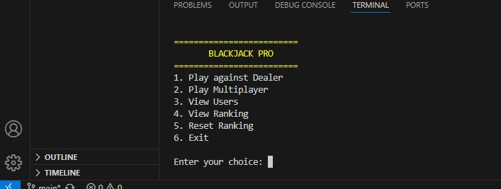

Juego 1:

Nombre del juego:
Trivia Bichota.

Temática y ambientación:

Juego de preguntas y respuestas ambientado en una atmósfera divertida y moderna. Las preguntas se enfocan en cultura general, entretenimiento y temas juveniles.

Mecánica principal:
El jugador responde preguntas con cuatro opciones. Por cada respuesta correcta gana puntos. Al final del juego, se muestran los resultados.

Idea general de la jugabilidad:
1.El jugador ingresa su nombre.
2.Se cargan preguntas desde un archivo.
3.Cada pregunta tiene 4 opciones y una correcta.
4.Se lleva control de respuestas correctas y se muestra el resultado al final.

Aplicación de los temas vistos:
Variables y tipos de datos:
Ejemplo:

int juego, salir = 0, opcion, us;
string name = "";
char answer;
Estas variables almacenan las opciones de menú, nombres de usuarios, respuestas a preguntas y estados del juego.

Estructuras condicionales: (if, else, switch)
Ejemplos:

Uso de switch para seleccionar el juego:

switch (juego) {
    case 1:
        // Código para trivia
        break;
    case 2:
        // Código para blackjack
        break;
    default:
        cout << "Debe ingresar una opción" << endl;
        break;
}
Uso de if-else para validar respuesta correcta:

if (answer == preguntas[i].respuesta) {
    cout << "Respuesta correcta +10 puntos\n";
    puntaje += 10;
} else {
    cout << "Respuesta incorrecta -5 puntos\n";
    puntaje -= 5;
}

Ciclos: (for, while, do-while)
Ejemplos:

for para mostrar 7 preguntas en una categoría:

for (int i = 0; i < 7; i++) {
    cout << "Pregunta " << i + 1 << ": " << preguntas[i].texto << endl;
    // Mostrar opciones y recibir respuesta
}
do-while para repetir menú de opciones hasta salir:

int opc;
do {
    cout << "1. Mostrar usuarios\n2. Seleccionar usuario\n3. Eliminar usuario\n4. Salir\n";
    cin >> opc;
    // acciones según opc
} while (opc != 4);

Funciones:
Ejemplos:

Función para crear un usuario:

void crearUSUARIO() {
    Usuario u;
    cout << "Nombre de usuario, sin espacios: ";
    cin >> u.name;
    u.puntaje = 0;
    usuarios.push_back(u);
    guardarUsuarios();
    name = u.name;
    cout << "Usuario creado con éxito" << endl;
}
Función para jugar una categoría (generalizada):

void jugarCategoria(vector<pregunta> &preguntas) {
    for (int i = 0; i < 7; i++) {
        cout << "Pregunta " << i + 1 << ": " << preguntas[i].texto << endl;
        // lógica de respuesta
    }
    // actualización de puntaje
}

Estructuras de datos:
Ejemplos:

Definición de la estructura para preguntas:
struct pregunta {
    string texto;
    vector<string> opciones;
    char respuesta;
};
Uso de vectores para almacenar preguntas:

vector<pregunta> preguntah = { /* preguntas de historia */ };
vector<Usuario> usuarios;

Manejo de archivos:
Ejemplo para guardar usuarios:

void guardarUsuarios() {
    ofstream archivo("usuario.txt");
    if (archivo.is_open()) {
        for (const Usuario &user : usuarios) {
            archivo << user.name << " " << user.puntaje << endl;
        }
        archivo.close();
    }
}
Ejemplo para cargar usuarios:

void cargarUsuarios() {
    usuarios.clear();
    ifstream archivo("usuario.txt");
    Usuario u;
    if (archivo.is_open()) {
        while (archivo >> u.name >> u.puntaje) {
            usuarios.push_back(u);
        }
        archivo.close();
    }
}

Manejo de errores:
Ejemplo: Verificación apertura de archivo

if (archivo.is_open()) {
    // trabajar con archivo
} else {
    cout << "Error al abrir el archivo" << endl;
}
Ejemplo: Validación opción menú

switch (opc) {
    case 1: mostrarUSUARIO(); break;
    case 2: seleccionarUsuario(); break;
    case 3: eliminarUsuario(); break;
    case 4: cout << "Saliendo de opciones.\n"; break;
    default: cout << "Opción inválida.\n"; break;
}

Interfaz por consola
Ejemplos:

Mostrar mensaje y recibir opción:

cout << "Bienvenido a Juegos Bichotas, selecciona uno de los dos juegos:\n1. Trivia Bichota\n2. Blackjack Bichota" << endl;
cin >> juego;

Mostrar preguntas y opciones:

cout << "Pregunta " << i + 1 << ": " << preguntas[i].texto << endl;
for (const auto &opcion : preguntas[i].opciones) {
    cout << opcion << endl;
}
cin >> answer;

Consideraciones técnicas:
1.Las preguntas se almacenan en un archivo de texto plano.
2.El programa valida entradas y muestra resultados.
3.Se usa ifstream para leer archivos y getline para manejar strings.
4.Se usan colores ANSI para la interfaz.

Mockup del juego:

Imágenes del juego: 

Hi

His

Hiss

Juego 2:

Nombre del juego:
Blackjack Bichota.

Temática y ambientación:
Un juego de cartas con estilo empoderado y visual llamativo. Inspirado en el clásico Blackjack, pero con logros, mensajes coloridos y actitud "bichota".

Mecánica principal:
1.Sumar cartas sin pasarse de 21 para vencer al dealer o a otros jugadores. Se aplican reglas clásicas:
2.Figuras valen 10.
3.As vale 1 o 11 según convenga.

Idea general de la jugabilidad:
1.Jugar contra el dealer o en modo multijugador.
2.Se reparten 2 cartas por jugador.
3.Puedes pedir más cartas o plantarte.
4.Ganas si llegas a 21, o si tienes mejor mano sin pasarte.
5.Se muestra ranking y usuarios guardados.

Aplicación de los temas vistos:
Variables y tipos de datos:
Se usan int, string, char, bool y vector<Card> en todo el juego.
Ejemplo:

int sum = 0;
string name;
vector<Card> hand;

Estructuras condicionales: (if, else, switch)
Controlan la lógica de turnos, validaciones de entrada y reglas del juego.
📌 Ejemplo:

if (player.calculatePoints() > 21) {
    displayMessage("Te pasaste de 21", RED_COLOR);
}

Ciclos: (for, while, do while)
Se utilizan para recorrer jugadores, pedir cartas y repetir menús.
📌 Ejemplo:

while (choice != 'n') {
    Card newCard = deck.deal();
    player.receiveCard(newCard);
}

Funciones:
Se organizan funciones por responsabilidad: playerTurn, dealerTurn, playAgainstDealer, etc.
📌 Ejemplo:

void playAgainstDealer(mt19937& rng) { ... }

Estructuras de datos:
Se creó la estructura Card para representar una carta con su palo, valor y puntos.
📌 Ejemplo:

struct Card {
    string suit;
    string rank;
    int points;
};

Manejo de archivos:
Se guardan usuarios y ranking en archivos .txt usando ifstream y ofstream.
📌 Ejemplo:

ofstream file("ranking.txt", ios::app);
file << name << endl;

Manejo de errores
Se lanza una excepción si se intenta repartir una carta de una baraja vacía.
📌 Ejemplo:

if (cards.empty()) {
    throw runtime_error("La baraja está vacía.");
}

 Interfaz por consola
El juego usa colores ANSI, impresión dinámica de manos y mensajes interactivos.
📌 Ejemplo:

displayMessage("¡BLACKJACK!", MAGENTA_COLOR);
displayCardText(carta.rank, carta.suit);

Consideraciones técnicas:
Uso de std::shuffle, random_device, mt19937 para mezcla de cartas.
Modularidad con clases separadas en archivos .h y .cpp.
Validación de entradas con cin.fail(), cin.clear(), cin.ignore().
Archivos persistentes para almacenar ranking y jugadores.

Imagenes:
1. Asa

2. Panal

3. Pi

Integrantes del Proyecto:

José Luis Hernandez Vasquez   00126525
Maria Jose Hernandez Flores   00017425
Pablo David Labor Lazo        00030325
Kevin Daniel Aguilar Cerritos 00026825
